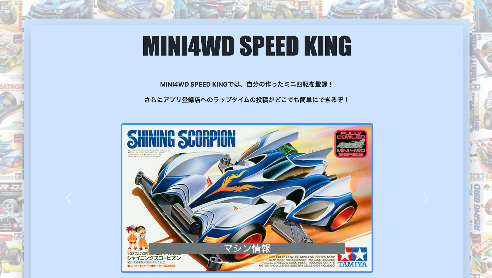

# MINI4 SPEED KING

## アプリ概要・利用目的
アプリに登録してある店舗ごとに**ラップタイム**を投稿することが可能になっています。

さらに、ご自身が使用されているミニ四駆のマシン情報を登録していただくことができ、他ユーザーが登録したマシン情報を閲覧することもできます。

登録されている店舗情報には、**営業時間・定休日・住所**といった基本情報だけでなくコースレイアウトや他ユーザーのラップタイム、GoogleMAPと連携した地図情報を確認することもできるようになっています。

## アプリのファーストビュー

## アプリを作るに至った経緯
私自身ミニ四駆を愛しており、１人でコース設置店へ走らせに行くことがあるのですが、ミニ四駆ブームだった時と比べると初心者や１人で楽しむには少し敷居が高くなってしまっている傾向にあるように感じられます。

親切な方が多く速くするためのアドバイスを教えてくれる事が度々ありますが、なかには黙々と１人で楽しみたい方もいられると思います。私もすこし苦手であり、今でも１人でコースに行くと走らせることに緊張する事があります。

ミニ四駆は速さを競うものであり、コース設置店には**ラップタイムボード**というものが置いてあります。ここに記入されているラップタイムは、その店の猛者たちが上位を占めておりこの点も敷居が高くなっている原因となっています。

それでも１人のレーサーとして「**自分のタイムを記録には残したい！**」「**もっと気軽に楽しみたい！**」そんな思いからアプリ作成に至りました。

## URL

This README would normally document whatever steps are necessary to get the
application up and running.

Things you may want to cover:

* Ruby version

* System dependencies

* Configuration

* Database creation

* Database initialization

* How to run the test suite

* Services (job queues, cache servers, search engines, etc.)

* Deployment instructions

* ...
