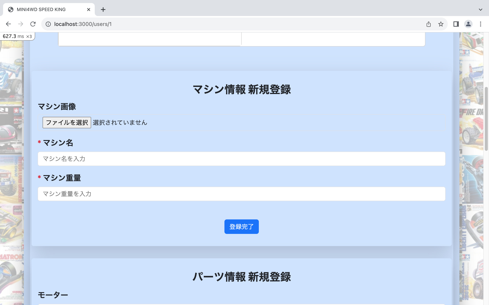
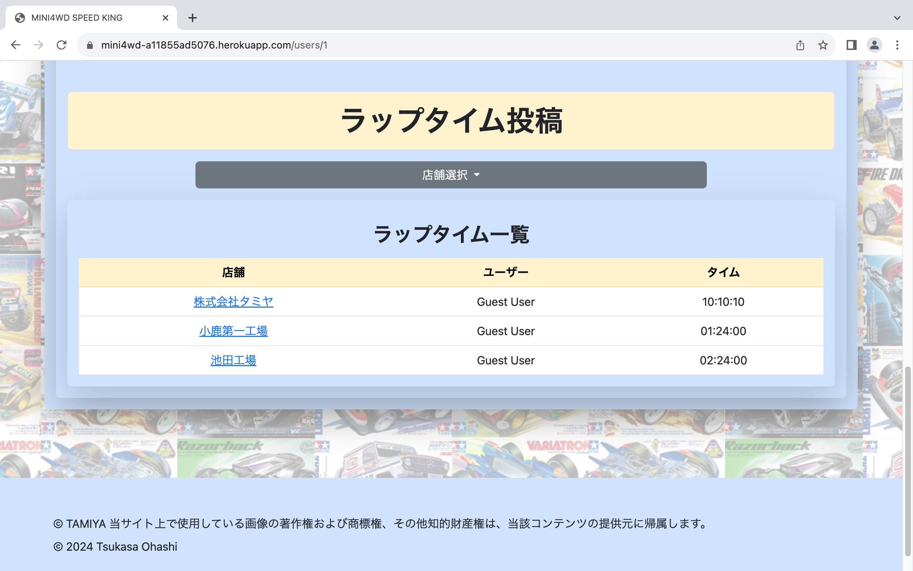
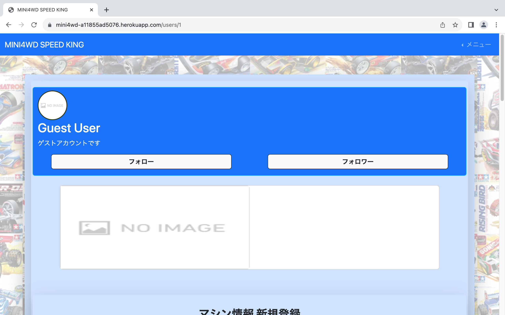

# MINI4 SPEED KING

## アプリ概要・利用目的
アプリに登録してある店舗ごとに**ラップタイム**を投稿することが可能になっています。

さらに、ご自身が使用されているミニ四駆のマシン情報を細かく登録していただくことができ、他ユーザーが登録したマシン情報を閲覧が可能。気になるユーザーをフォローすることができます。

**相互フォロー**となった場合のみチャットルームが利用できるようになり、ユーザー間での会話を楽しむことができます。

登録されている店舗情報には、**営業時間・定休日・住所**といった基本情報だけでなくコースレイアウトや他ユーザーのラップタイム、GoogleMAPと連携した地図情報を確認することもできるようになっています。

## 開発にあたって
私自身ミニ四駆を愛しており、１人でコース設置店へ走らせに行くことがあるのですが、ミニ四駆ブームだった時と比べると初心者や１人で楽しむには少し敷居が高くなってしまっている傾向があるように感じられます。

親切な方が多く、ミニ四駆を速くするためのアドバイスを教えてくれる事が度々ありますが、なかには黙々と１人で楽しみたい方もいられると思います。私もすこし苦手であり、今でも１人でコースに行くと走らせることに緊張する事があります。

ミニ四駆は速さを競うものであり、コース設置店には**ラップタイムボード**というものが置いてあります。ここに記入されているラップタイムは、その店の猛者たちが上位を占めておりこの点も敷居が高くなっている原因となっています。

それでも１人のレーサーとして「**自分のタイムを記録には残したい！**」「**もっと気軽に楽しみたい！**」そんな思いからアプリ開発に至りました。

## URL
### Heroku
https://mini4wd-a11855ad5076.herokuapp.com/

・　画面中部のログインボタンからメールアドレス・パスワード入力画面へ

・　ゲストログインボタンから新規登録不要でアプリを体験できます

## 使用技術
### フロントエンド
**・　HTML** 

**・　CSS** 

**・　JavaScript** 

**・　Bootstrap**

### バックエンド
**・　Ruby** 

**・　MySQL** 

**・　Ruby On Rails** 

**・　Google MAP API** 

### インフラ
**・　AWS**

**・　Heroku**

### その他
**・　GitHub**

## 機能一覧
**・　ユーザー登録/ログイン(devise)**

**・　ミニ四駆情報登録 (マシン名/重量/モーター/シャーシ)**

**・　店舗情報閲覧(店名/営業時間/定休日/住所)**

**・　ラップタイム登録**

**・　他ユーザー情報閲覧**

**・　Google MAP API**

## ER図

## テスト
**・　RSpec**

## 機能紹介
### Topページ
アプリのタイトルと機能内容が一目でわかるようなシンプルなデザインで表現しました。

### ログインページ
ゲストログイン機能があるので新規登録不要でアプリを体験いただけます。(ゲストログインボタンはTopページにて実装)

通常ログインにはメールアドレス/パスワードによるログインを実装しました。

### ミニ四駆情報登録
マシン画像/マシン名/重量の基本情報に加えてミニ四駆に必要な構成パーツを細かく登録可能です。

セレクトボックスから使用しているパーツを選択するだけで登録できるシンプルな作りになっています。

パーツ登録完了でパーツリストとして閲覧できるようになり、一目でどのパーツを使用しているか分かるようになります。

### ラップタイム登録
登録店舗詳細画面にてラップタイムの新規投稿が可能になっています。

店舗詳細画面に表示されるラップタイムは登録した全ユーザーのラップタイムとなるように実装しました。

各ユーザーのプロフィール画面にもラップタイムを表示するテーブルを実装し、こちらはユーザーが登録した店舗とラップタイムが表示されるように実装致しました。

### ユーザー間の相互フォロー機能
気になったユーザーをフォローすることができる機能を実装しました。

フォローとフォロワーの一覧もボタンひとつで確認可能となっています。

### ユーザー間のチャット機能
ユーザー同士が相互フォローとなった場合に限り、チャットルームが開設されて、チャット形式の会話ができる機能を実装しました。

フォロー相手の発言と自分の発言の背景色を変えることでどちらの発言なのかわかりやすいようになっています。

### ユーザー一覧機能
新規登録を行なったユーザー情報を一覧として表示することができます。

## 開発までのながれ
### 10月〜3月
**・　ポテパンキャンプ受講**

### 4月
**・　開発テーマの選定**

**・　全体構造の構築**

**・　RubyOnRailsで開発開始**

**・　各機能の実装**

**・　RSpecでテスト実装**

**・　AWS/Herokuと連携・本番環境構築**

### 5月中旬
**・　ポートフォリオ完成**

## 今後について
学習始めの頃はバックエンドのコーディングに対して苦手意識があり、うまく動作しない状況に挫けそうな場面が多々見受けられたがデバッグ方法や参考書からの知識を得て１つずつエラーを解決していく工程にやりがいを感じるようになりました。

調べるとバックエンドに役立つ資格取得も可能とのことであったので第一目標として学習を進める予定です。

あわせて日々アップデートされているプログラミング言語に対応していけるように新しい言語習得も視野に入れて学習していきます。
